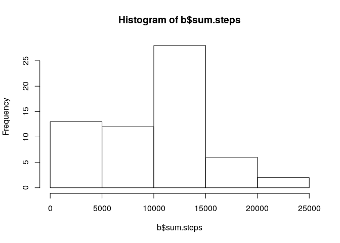

# Reproducible Research: Peer Assessment 1


## Loading and preprocessing the data


```r
unzip("activity.zip")
a <- read.csv("activity.csv")
a$date <- as.Date(a$date)
```

## What is mean total number of steps taken per day?


```r
library(dplyr)
```

```
## 
## Attaching package: 'dplyr'
```

```
## The following objects are masked from 'package:stats':
## 
##     filter, lag
```

```
## The following objects are masked from 'package:base':
## 
##     intersect, setdiff, setequal, union
```

```r
b <- group_by(a, date) %>%
        summarize(sum(steps, na.rm=TRUE))
names(b) <- c("date", "sum.steps")
hist(b$sum.steps)
```

<!-- -->

```r
mean(b$sum.steps)
```

```
## [1] 9354.23
```

```r
median(b$sum.steps)
```

```
## [1] 10395
```

## What is the average daily activity pattern?


```r
c <- group_by(a, interval) %>%
    summarize(mean(steps, na.rm=TRUE))
plot(c, type="l")
```

<!-- -->

```r
names(c) <- c("interval", "mean.steps")
max(c$mean.steps)
```

```
## [1] 206.1698
```

## Imputing missing values
We will use the mean value for each 5-minute interval as replacment for NAs.

```r
sum(is.na(a))
```

```
## [1] 2304
```

```r
f <- function(s, i){
    if (is.na(s)) {
        return ((filter(c, interval == i))[[1,2]])
    } else {
        return (s)
    }
}
d <- data.frame(steps=mapply(f, a$steps, a$interval),
                date = a$date,
                interval = a$interval)
e <- group_by(d, date) %>%
    summarize(sum(steps, na.rm=TRUE))
names(e) = c("date", "sum.steps")
hist(e$sum.steps)
```

<!-- -->

```r
mean(e$sum.steps)
```

```
## [1] 10766.19
```

```r
median(e$sum.steps)
```

```
## [1] 10766.19
```

Difference between the means and medians of the original data and that of the
data including the imputed values.


```r
mean(b$sum.steps) - mean(e$sum.steps)
```

```
## [1] -1411.959
```

```r
median(b$sum.steps) - median(e$sum.steps)
```

```
## [1] -371.1887
```

## Are there differences in activity patterns between weekdays and weekends?


```r
g <- function(d) {
    if (weekdays(d) == "Saturday" | weekdays(d) == "Sunday") {
        return ("weekend")
    } else {
        return ("weekday")
    }
}
a$weekday.or.weekend <- sapply(a$date, g)
weekday <- a %>%
    filter(weekday.or.weekend == "weekday") %>%
    group_by(interval) %>%
    summarize(sum(steps, na.rm=TRUE))
names(weekday) <- c("interval", "steps")
weekend <- a %>%
    filter(weekday.or.weekend == "weekend") %>%
    group_by(interval) %>%
    summarize(sum(steps, na.rm=TRUE))
names(weekend) <- c("interval", "steps")
par(mfcol=c(2,1))
plot(weekday$interval, weekday$steps, type="l", xlab="time interval", ylab="steps", main="weekday")
plot(weekend$interval, weekend$steps, type="l", xlab="time interval", ylab="steps", main="weekend")
```

<!-- -->
